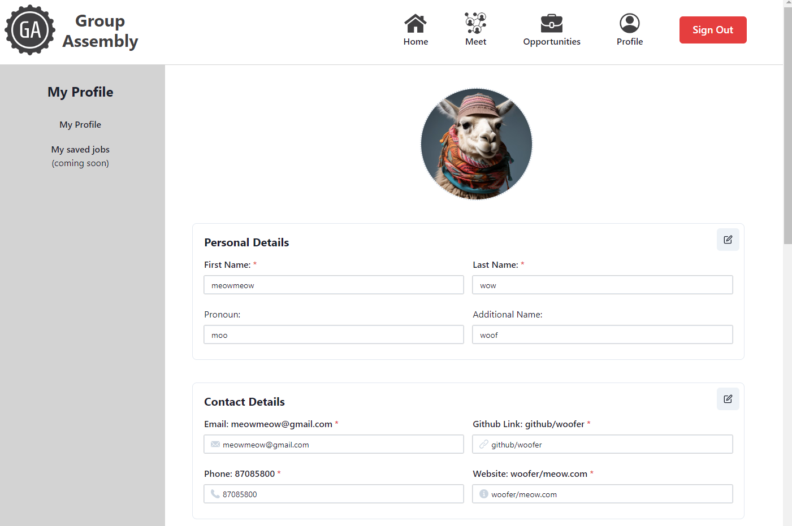

# GA-Alumni-Network

This is a platform for GA's alumni to find each other, to share opportunities and to maximise possibilities! 

https://seif17-trinity-proj-03.onrender.com/

***

## Screenshots
#### Landing Page


#### Sign Up Page (User Model & Authentication)


#### Opportunities Page (Job Model)


#### Profile Page (Profile Model)


***
## Technologies Used
* Javascript
* React JS 
* MongoDB
* Mongoose
* ChakraUI 

***
## Process
#### Planning & Workflow


#### ERD


#### UI Sketch (Figma)


***
#### Favourites

```
async function updateProfile(filter, update, options) {
    try {
        console.log("update: ", update)
        // Construct update object dynamically
        const dynamicUpdate = {};
        if (update.personalDetails) {
            dynamicUpdate['personal_details'] = update.personalDetails;
        }
        if (update.contactDetails) {
            dynamicUpdate['contact_details'] = update.contactDetails;
        }
        if (update.profilePic) {
            dynamicUpdate['profilePic'] = update.profilePic;
        }
        if (update.gaExperience) {
            dynamicUpdate['ga_experience'] = update.gaExperience;
        }
        if (update.workExperience) {
            dynamicUpdate['work_experience'] = update.workExperience;
        }
        if (update.educationExperience) {
            // console.log("educationExperience: ",update.educationExperience )
            dynamicUpdate['education_experience'] = update.educationExperience;
        }
        if (update.skills) {
            dynamicUpdate['skills'] = update.skills;
        }
        // Add more fields as necessary

        // Perform the update
        const updatedProfile = await profilesDao.findOneAndUpdate(filter, {
            $set: dynamicUpdate
        }, options);

        console.log("Model updateProfile: ", updatedProfile);
        return updatedProfile;
    } catch (error) {
        console.error('Error updating profile', error);
        throw error;
    }
}

```

```
const profileSchema = new Schema({
    listing_id: {
        type: Schema.Types.ObjectId,
        default: () => new mongoose.Types.ObjectId(),
        unique: true, 
        required: true
    },

    user_id: {
        type: Schema.Types.ObjectId,
        ref: "User",
        required: true
    }, 

    personal_details: personalDetailsSchema,

    contact_details: contactDetailsSchema,

    ga_experience: [gaExperienceSchema],

    work_experience: [workExperienceSchema], 

    education_experience: [educationExpSchema],

    skills: {
        type: [String],
        required: true
    }, 

    profilePic: {
        type: String //for Cloudinary imageURL
    }, ......

```

***

## Challenges Faced 

* "i think for me it would have to be frontend side trying to fetch data from the backend
sometimes when theres error 500 u dunno which code went wrong in the backend" - Conan
* "the whole process of updating data - either can't fetch or not submitting properly.
then so many files to check to diagnose what went wrong, sometimes no error." 

```
const updatedProfile = await profilesDao.findOneAndUpdate(filter, .....
```

```
STANDARDISING NAMING 
async function createProfile(req, res) {
    try {
        const {
            user_id,
            personalDetails,
            contactDetails,
            gaExperience,
            workExperience,
            educationExperience,
            profilePic,
            skills,
        } = req.body;

        const profileData = {
            user_id,
            personal_details: personalDetails,
            contact_details: contactDetails,
            ga_experience: gaExperience,
            work_experience: workExperience,
            education_experience: educationExperience,
            profilePic: profilePic,
            skills: skills,
        };

        const { success, data, error } = await profileModel.createProfile(profileData);
        // console.log("Controller profileData: ", profileData)

        if (!success) {
            return res.status(400).json({ error });
        }

        res.status(201).json(data);
    } catch (error) {
        console.error("Error creating profile:", error);
        res.status(500).json({ error: 'Failed to create profile' });
    }
}

```

***

## Things we learned

1. Many things. 

***

## Next Steps

* Touch on icebox items
* Enhance communication functions for the platform for networking 
* More seamless user experience

***
## Attributions
* [ChakraUI](https://v2.chakra-ui.com/getting-started) 
* [Cloudinary](https://cloudinary.com/)
* Special thanks to Shao Quan & Waihon for all the support & guidance 
